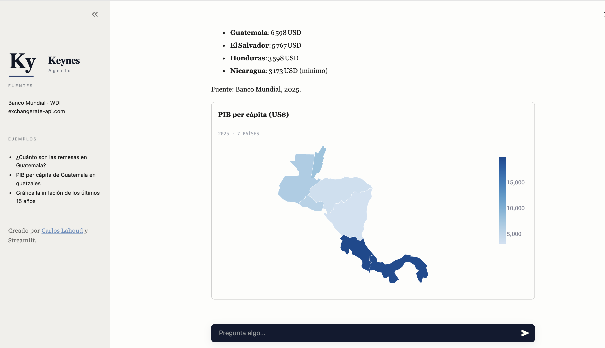
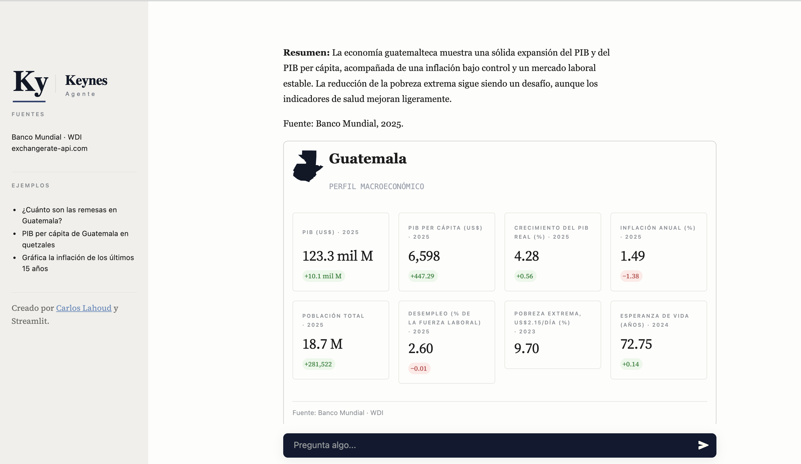

# Keynes Agent

Agente conversacional de análisis económico. Responde consultas sobre indicadores
macroeconómicos consultando APIs públicas en tiempo real, y devuelve gráficos
interactivos, fichas de país y mapas coropléticos.

Construido en Python con Groq, Streamlit y Altair.




## Qué hace

El agente no responde de memoria: cada cifra que reporta proviene de una llamada
a una API, con su fuente y su año de publicación. Si un dato no existe, lo dice
en lugar de estimarlo.

Ejemplos de consultas:

- ¿Cuál es el PIB per cápita de Guatemala y cuánto es eso en quetzales hoy?
- Gráfica la evolución de las remesas como porcentaje del PIB
- Compara la inflación de Guatemala, México y Costa Rica en los últimos 5 años
- Dame el panorama económico de Guatemala
- Muéstrame el PIB per cápita de Centroamérica en un mapa

## Herramientas

| Herramienta | Qué hace | Fuente |
|---|---|---|
| `indicador_bm` | Consulta uno de 30 indicadores macroeconómicos por país | Banco Mundial |
| `convertir_moneda` | Convierte montos entre monedas al tipo de cambio del día | open.er-api.com |
| `fecha_hora` | Fecha y hora actual en Guatemala | Local |
| `graficar_bm` | Serie histórica de un indicador como gráfico de línea | Banco Mundial |
| `comparar_paises` | Compara un indicador entre 2 y 5 países, con métricas calculadas | Banco Mundial |
| `ficha_pais` | Perfil macroeconómico completo con contorno geográfico | Banco Mundial |
| `sectores_pib` | Composición del PIB por sector económico | Banco Mundial |
| `mapa_indicador` | Mapa coroplético de un indicador para varios países | Banco Mundial |

## Fuentes de datos

Ambas APIs son públicas y no requieren autenticación:

- **[Banco Mundial — Indicators API](https://datahelpdesk.worldbank.org/knowledgebase/articles/889392)**
  — 30 indicadores curados: actividad económica, precios, empleo, sector externo,
  remesas, finanzas públicas, sector financiero, desarrollo y estructura económica.
- **[open.er-api.com](https://open.er-api.com)** — tipo de cambio diario, incluye GTQ.

La geometría de los mapas viene de
[world-atlas](https://github.com/topojson/world-atlas) vía `vega_datasets`.

## Instalación

```bash
git clone https://github.com/cl1199/keynes-agent.git
cd keynes-agent

python3 -m venv env
source env/bin/activate          # Windows: .\env\Scripts\activate

pip install --upgrade pip
pip install -r requirements.txt
```

Crea un archivo `.env` en la raíz con tu llave de [Groq](https://console.groq.com):

```
GROQ_API_KEY=tu_llave_aqui
```

El `.env` está en `.gitignore` y no debe subirse al repositorio.

## Uso

```bash
streamlit run app.py
```

Se abre en `http://localhost:8501`.

También funciona en modo terminal, sin interfaz:

```bash
python Keynes_agent.py
```

## Arquitectura

Tres archivos con responsabilidades separadas:

```
keynes_tools.py    Las herramientas: llaman a las APIs, parsean y devuelven diccionarios.
                   No sabe nada del LLM ni de la interfaz.

Keynes_agent.py    El agente: prompt del sistema, esquemas de herramientas y el bucle
                   de tool calling. Devuelve (texto, resultados).

app.py             La interfaz: estado de sesión, chat y renderizado de visuales
                   con Altair. No hace ninguna llamada HTTP.
```

Tres decisiones que definen el diseño:

**Las herramientas nunca lanzan excepciones.** Todo error se devuelve como
`{"error": "..."}`, viaja al modelo como resultado de la herramienta, y este
informa al usuario. Una API caída no tumba la conversación.

**El modelo decide qué consultar, nunca calcula.** Las variaciones, promedios y
brechas se computan en Python antes de llegar al modelo. Esto elimina la
superficie donde un LLM suele equivocarse: la aritmética.

**Los datos y su presentación están separados.** Las herramientas devuelven
series con un campo `tipo`; `app.py` decide cómo dibujarlas. Cambiar la
visualización no requiere tocar la lógica de datos.

El agente mantiene una ventana de memoria de los últimos 10 mensajes y cachea
las respuestas del Banco Mundial en memoria durante la sesión. El tipo de cambio
no se cachea, porque un valor viejo sería incorrecto.

## Limitaciones

- **Los datos son anuales.** El Banco Mundial no publica series de alta
  frecuencia, así que el agente no puede responder sobre inflación mensual,
  remesas del mes pasado o reservas semanales.
- **Cada indicador tiene su propio rezago.** El PIB llega a 2025, las remesas a
  2024, el índice de Gini a 2023. El agente reporta el año de cada cifra, pero
  no son directamente comparables entre sí.
- **No usa fuentes nacionales.** El Banco Mundial reproduce datos que producen
  los institutos nacionales; para el dato oficial guatemalteco habría que
  consultar directamente al INE, MINFIN o Banguat.
- **Cobertura desigual.** Algunos indicadores no existen para todos los países.
  El agente lo reporta en vez de estimarlo.
- **El índice de Gini y la pobreza vienen de encuestas de hogares** con
  metodologías que cambian entre levantamientos, así que la comparación
  intertemporal debe hacerse con cuidado.

## Créditos

Desarrollado por [Carlos Lahoud](https://www.linkedin.com/in/carlos-lahoud/).

El proyecto nació como la Práctica 1 del curso de Data Analytics de la
Universidad Rafael Landívar, y se extendió más allá de los requerimientos
originales.

## Licencia

MIT
